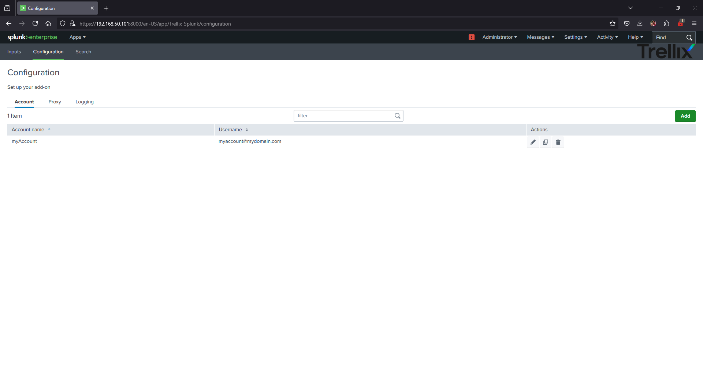

# Trellix MVision EPO Add-on for Splunk

Trellix MVision EPO Add-on for Splunk was developed to solve the data ingest from Trellix MVision EPO (formerly McAfee EPO) API on Splunk to use cases in Splunk Enterprise and Splunk Enterprise Security. Trellix MVision EPO Add-on for Splunk is the Technical Add-on (TA) developed for ingest or map security data collected from Trellix MVision EPO API. Trellix MVision EPO Add-on for Splunk provides common information model (CIM) knowledge, to use with other Splunk Enterprise Apps such Splunk Enterprise Security.

> [!IMPORTANT]: This add-on was developed to solve the ingestion for Trellix EPO SaaS, not for On-prem and/or other Trellix services.

## Release notes

* Version 1.0.0: Sep 01, 2023 App created. Creates integration between Trellix EPO and Splunk Enterprise to ingest data via API. Allows multiple accounts to create connections, and supports duplicated accounts with multiple tenants. Exclusive usage for Trellix EPO API, because Endpoint path is fixed in code. Allows to use regional-based Endpoint URL, refers to Trellix documentation in <https://docs.trellix.com/bundle/epolicy-orchestrator-saas-product-guide/page/GUID-E8D5F121-7544-4302-837D-A68053C95B4D.html>
* Version 1.0.1: Feb 29, 2024
Solved an issue related with timeformat that does not allow to ingest data into Splunk when receivedutc field value has not milliseconds in it. Now, timeformat function will check if the timestamp field has or not milliseconds and, with that, will apply the timeformat required.
* Version 1.0.2: Mar 11, 2024
Renamed the application to correct a misunderstanding of the name, since the application only applies to Trellix MVision EPO (formerly McAfee EPO) SaaS, and not to other SaaS or On-Prem Trellix products. Updated to make it Cloud-compatible, based on new Cloud Vetting Policies from Splunk.
* Version 1.0.3: May 01, 2024
Corrected Help information in Configuration page that has an issue for text length.
* Version 1.0.4: Mar 31, 2025
Updated Splunk Python Library to newest one based on Splunk Vetted Program.

## Installation

When installing Trellix Add-on for Splunk in your environment, please, meet following requirements:

* Splunk version: >=8.0.0.
* In distributed/clusterized environment, it is recommended to install the add-on into a heavy forwarder.
* In single instance/distributed non-clusterized environment, you must install in a search head, indexer and/or heavy forwarder. Please, install the add-on only in one of those servers to ingestion purposes. You can install the add-on in other servers for parsing purposes.

After install add-on, please configure the add-on based on following suggestions:

* After install, please set the required account. In your Splunk Web, go to Apps/Trellix MVision EPO Add-on for Splunk, click on *Configuration* and in the *Account* section, click **Add**

* When adding new account, fill the fields as suggested
  * Set a recognizable Account name for each account that you might want to be added.

  * Select the required URL for your Trellix Tenant. You have that URL in the Welcome email that Trellix sent you. Please refer to <https://docs.trellix.com/bundle/epolicy-orchestrator-saas-product-guide/page/UUID-beb1dd85-b05c-ec11-5d94-b9b647f99a55.html> to get an updated list of endpoints. The list of URLs notes "Global" and "US" as the same URL. Other URLs points for co-located endpoints.

  * Set your Username and Password. The username must be in email account format `myaccount@mydomain.com`. Please follow Trellix documentation to set appropriate permissions. Set the required Tenant ID too. This data can be retrieved from Trellix Account settings page, and is required in case your user account relies on multiple tenants. If not, leave this field with default value ("default")

  * Finally, click *Add*. Then, you will have the required account configured to be used in the inputs page.

* After configure the account, please click on *Inputs* section, and then click **Create New Input**

* When adding a new input, fill the fields as suggested:
  * Set a recognizable Input name for each input that you might want to be added.

  * Set time interval to fetch data from Trellix in seconds. Suggested minimum interval is 60 seconds.
  * Select the appropriate index to be used. If you leave *default*, will use index=main. Please, create an index before set the input instance.

  * Select the appropriate Global account to be used. This should have been created following the steps above. Then, click *Add*. You will have the required Input configured to fetch events and incidents for Trellix MVision EPO.

## Issues

Please, feel free to create an Issue in [Issues](/../../issues/new). Please, include all information required to this Issue be analyzed and solved. In case of issues related with Trellix services, please refer with their Support services.

## Contributing

Pull requests are welcome. For major changes, please open an issue first to discuss what you would like to change.

Please make sure to update tests as appropriate.

## License

[MIT](https://choosealicense.com/licenses/mit/)
